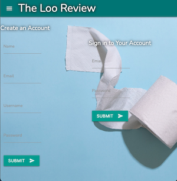
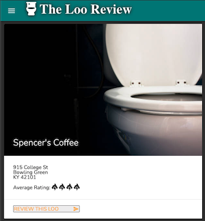
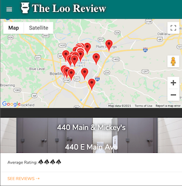
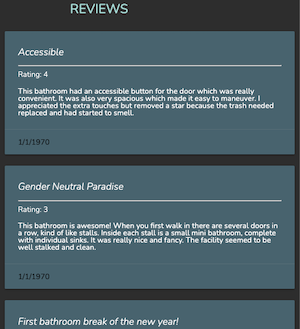

# The Loo Review

<!-- Blurb.
Express.js API and SQL. -->

## Table of Contents

- [Description](#description)
- [Usage](#usage)
- [Future Development](#future-development)
- [Contribute](#contribute)
- [Contact Me](#questions)
- [License](#license)

## Description

The Loo Review
---USER STORY---
As a user I want to be able to quickly find a bathroom in an given area. I would also like the ability to rate a restroom and see other user reviews.

This application allows users to find a restroom in there area and see all previous reviews with the timestamps either before or after the user visits the restroom. The user can then also choose to leave a review of thier own as well as add a business to the ever growing list.

## Visuals

 

 

[Heroku-DeployedApp] (<https://the-loo-review.herokuapp.com/>)

[Github-Repository] (<https://github.com/NAHco-code/Project-02.git>)
<!--
## Future Development

Future development. -->

## Contribute

Creators:
- Kathryn Wilkinson @[NAHco-code](https://github.com/NAHco-code)
- Brandon King @[thebsking](https://github.com/thebsking)
- Janee' Mays @[janee-elise-mays](https://github.com/janee-elise-mays)
- Sarehon Taylor @[SarehonTaylor](https://github.com/SarehonTaylor)

If you have something you'd like to contribute, make a pull request!

## Questions?

Please feel free to contact us with any questions via email.

- [kathrynxwilk@gmail.com](kathrynxwilk@gmail.com)
- [brandonscottking@gmail.com](brandonscottking@gmail.com)
- [janee.elise@gmail.com](janee.elise@gmail.com)
- [sarehontaylor@icloud.com](sarehontaylor@icloud.com)

## License

This project is licensed under the Apache 2.0 License.
For more information, please visit: [Apache Explained](https://choosealicense.com/licenses/apache-2.0/)

&copy; 2021 k.wilkinson | b.king | j.mays | s.taylor
